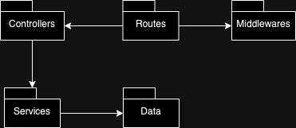

## Contact Manager Server

### Setup

Ensure the following software is installed:

- NPM (recommended version: 10 or above)
- Node.js (recommended version: v20 or above)
- Docker
- MySQL Workbench

### Run

To use this Contact Manager Server, follow these steps:

1. Clone the repository to your local machine.
1. Install the dependencies using `npm install`.
1. Open Docker and run
<pre><code>
   $ docker run -p 3306:3306 --name nodejs-mysql -e MYSQL_ROOT_PASSWORD=pass -e MYSQL_DATABASE=contact_management_db -d mysql:5.7
   $ docker container exec -it nodejs-mysql bash
   $ mysql -u root -p
</code></pre>
1. Make sure that you are running the mysql image on your Docker Dashboard
1. Copy the env.example file to .env and configure the environment variables, set a port and a phrase for the encryption (i.e. 3001 and "mysecretkey").
1. Also set on the .env your db credentials (i.e. DB_USER="root", DB_PASS="pass" and DB_NAME=contact_management_db).
1. Open MySQL Workbench, connect it to your DB.
1. Run the server using `npm run dev`.
1. The DB tables are now created so go to Users table and insert this row:
   <pre><code>
   INSERT INTO contact_management_db.users (id, username, password, name, title, profilePicture, phone, email, createdAt, updatedAt) VALUES (1, ‘user’, 'password', ‘eli, ‘dev’, 'picture', '099999', ‘elisa@example.com', now(), now());
   this allows you to have a registered user and login into the application.
   </code></pre>
   **Now you can run the front end and start using it!**

### Notes: Refactor

In the previous version of the server, all the logic and functionality were likely tightly coupled in a single file or module. This approach can lead to several issues, including difficulty in maintaining and scaling the application.

In the refactored version, the design follows a more modular approach, which is a key principle in software design. By breaking down the application into separate modules for routes, controllers, middleware, database, and services, the code becomes more organized, easier to understand, and more maintainable.

#### Here's how the improvements align with design principles:

- **Separation of Concerns:** Each module now has a specific responsibility, such as handling API endpoints (routes), processing business logic (controllers and services), managing authentication (middleware), and interacting with the database. This separation makes the codebase more modular and easier to manage.

- **Single Responsibility Principle (SRP):** Each module now follows the SRP by focusing on a single aspect of the application's functionality. For example, the controllers handle request processing, while the services handle the business logic, ensuring that each module has a clear and specific purpose.

- **Dependency Inversion Principle (DIP):** By abstracting the business logic from API calls, middleware, and the database, the design follows the DIP. This principle states that high-level modules should not depend on low-level modules directly but rather on abstractions. In this case, the controllers depend on services, which act as an abstraction layer for the business logic.

- **Open/Closed Principle (OCP):** The design is also aligned with the OCP, which states that software entities (classes, modules, functions, etc.) should be open for extension but closed for modification. If Express Router is deprecated in the future, the application can be updated by modifying the router module without affecting other parts of the application. This demonstrates the principle of stability in dependencies.
